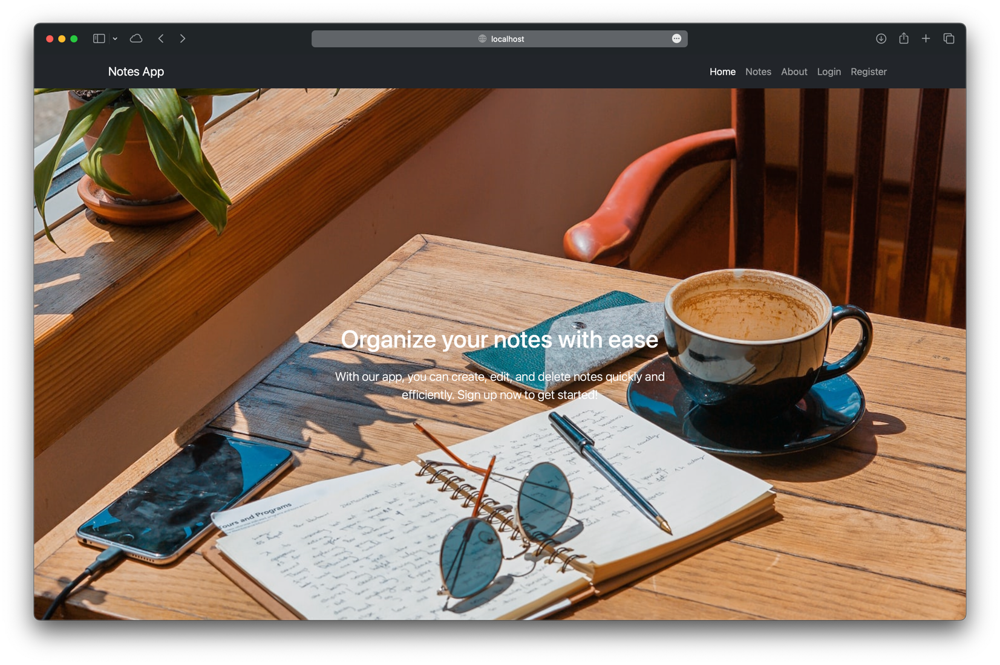

## Notes project

This is a project where you can create notes.
You can like them, update them and delete them (only if you are a registered user).
Initial configuration and population of the database is done with the configuration class InitDataConfig.
You can enter as an administrator with the following credentials:
- username: admin
- password: admin

## Technologies used
- Java 17
- Spring Boot
- Spring Security
- Spring Data MongoDB
- MongoDB
- Thymeleaf
- Bootstrap
- HTML
- CSS
- Maven
- Git
- IntelliJ IDEA

## How to run the project
Please make sure to populate the configuration file `application.properties` with your own data.

1. Clone the project
2. Open the project in IntelliJ IDEA
3. Run the project
4. Open the browser and go to http://localhost:8080/
5. Enjoy!